# DELTA

Create simple and beautiful static slides with Typst.

Delta is a divergent fork of slydst which allows the creation of slides using Typst headings.
This simplicity comes at the expense of dynamic content such as subslide animations.
For more complete and complex slides functionalities, see other tools such as Polylux.

Delta introduces several new features and enhancements, including:
- Hue-based theming and easy color customization
- Footer preview with section/subsection breadcrumbs
- Progress slider in the footer
- Custom layouts and aspect ratios
- Focus slides for emphasis
- Two-column slides with adjustable ratios
- Font and code font customization
- Global font size adjustment
- Improved title slide and logo support
- Enhanced definition, theorem, lemma, corollary, and algorithm blocks

See the [preview](#example) below.

## Quick start

Clone the repository:

```bash
git clone https://github.com/prirai/delta-typst-presentation.git
cd delta-typst-presentation
```

Copy or edit your `main.typ` in the `template/` folder, then run:

```bash
typst watch template/main.typ --root .
```

This will build and watch your slides using the Delta template.

**Project structure:**
```
.
├── lib.typ
├── LICENSE
├── README.md
├── slydst copy.typ
├── slydst.typ
├── svg/
│   └── example-*.svg
├── template/
│   ├── logo.png
│   ├── main.pdf
│   └── main.typ
├── thumbnail.png
└── typst.toml
```

## Usage

To start, use the following preamble in your `template/main.typ` (only the title is required):

```typst
#import "../slydst.typ": *

#show: slides.with(
  title: "Delta",
  subtitle: "A Fork of Slydst",
  authors: "Your Name",
  subslide-numbering: "(i)",
  logo: "template/logo.png",
)
```

Then, insert your content.
- **Level-one headings** (`=`) correspond to new sections.
- **Level-two headings** (`==`) correspond to new slides.
- Blank space can be filled with **vertical spaces** like `#v(1fr)`.

Example:
```typst
== Outline

#outline()

= Introduction

== Welcome to Delta

- Delta is an enhanced fork of Slydst, designed for creating professional presentations with Typst.
- This presentation showcases new features and customization options.

#v(2fr)

#lorem(15)
```

## Title page

Alternatively, you can omit the `title` argument and write your own title page.
Note that the `subtitle`, `date`, and `authors` arguments will be ignored in that case.

```typst
#show: slides.with(
  layout: "medium",
)

#align(center + horizon)[
  #text(2em, default-color)[*Delta: Slides in Typst*]
]

Insert your content here.
```

Or use the `title-slide` function for a properly centered title page with no page numbering:

```typst
#show: slides

#title-slide[
  #text(2em, default-color)[*Delta: Slides in Typst*]
]

Insert your content here.
```

## Components

Definitions, theorems, lemmas, corollaries, and algorithms boxes are also available:

```typst
#definition(title: "An interesting definition")[
  #lorem(20)
]
```

## Features & API

### `slides`

- `content`: `content` — content of the presentation
- `title`: `str` — title (required, unless using a custom title page)
- `subtitle`: `str` — subtitle
- `date`: `str` — date
- `authors`: `array` of `content` or `content` — list of authors or author content
- `layout`: `str` in (`"small"`, `"medium"`, `"large"`) — layout selection
- `ratio`: `float` or `ratio` or `int` — width to height ratio
- `title-color`: `color` or `gradient` — color of title and headings
- `subslide-numbering`: `none` or `str` — numbering of subslides
- `logo`: `str` — path to logo image (optional)
- `theme`: `str` — theme name (currently `"default"`)
- `base-hue`: `int` — base hue for color theming (default: 168)
- `font`: `str` — main text font (default: "Source Serif Pro")
- `code-font`: `str` — code font (default: "Dank Mono")
- `font-size`: `length` — global font size (default: 12pt)

### `title-slide`

- `content`: `content` — content of the slide

### `focus-slide`

- `content`: `content` — content of the slide
- `bg-fill`: `color` — background color (default: dark text color)
- `text-fill`: `color` — text color (default: light background color)

### `two-column-slide`

- `left-content`: `content` — left column content
- `right-content`: `content` — right column content
- `title`: `str` — optional slide title
- `left-ratio`: `ratio` — left column width (default: 1fr)
- `right-ratio`: `ratio` — right column width (default: 1fr)

### `definition`, `theorem`, `lemma`, `corollary`, `algorithm`

- `content`: `content` — content of the block
- `title`: `str` — title of the block
- `fill-header`: `color` — color of the header (optional)
- `fill-body`: `color` — color of the body (optional)
- `radius`: `length` — radius of the corners of the block (optional)

## Example

<kbd>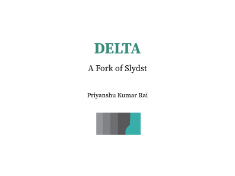</kbd> <kbd>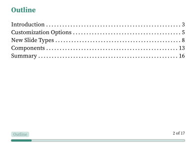</kbd> <kbd>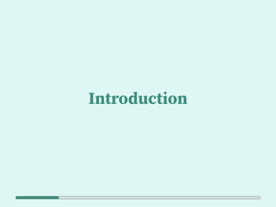</kbd> <kbd>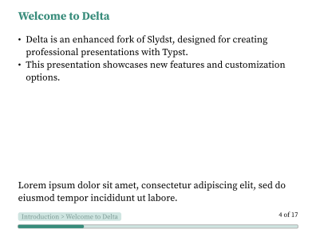</kbd> <kbd>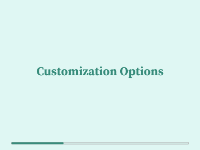</kbd> <kbd>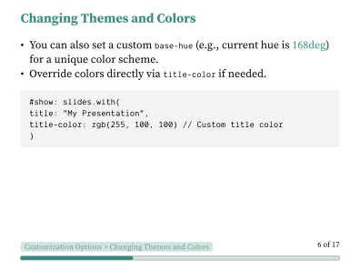</kbd> <kbd>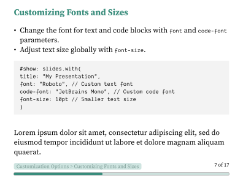</kbd> <kbd>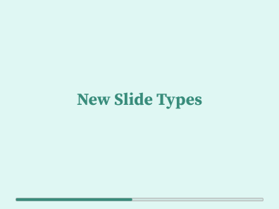</kbd> <kbd>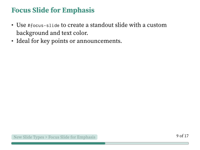</kbd> <kbd>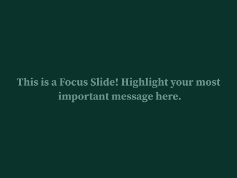</kbd> <kbd>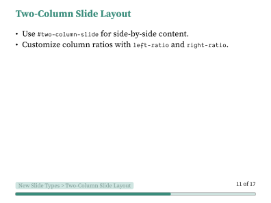</kbd> <kbd>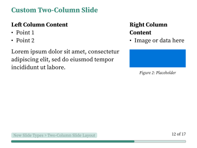</kbd> <kbd>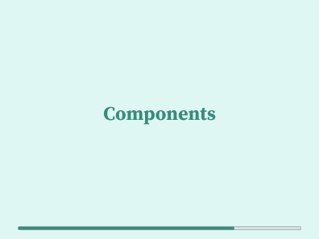</kbd> <kbd>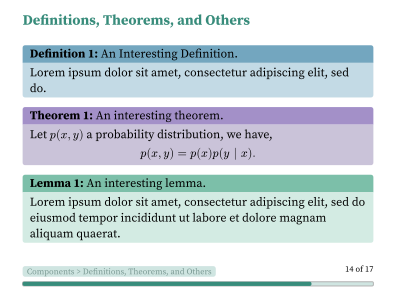</kbd> <kbd>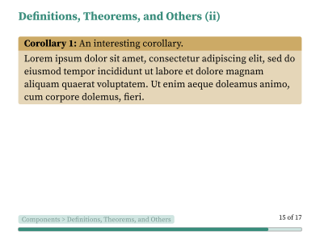</kbd> <kbd>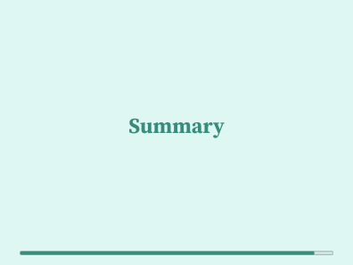</kbd> <kbd>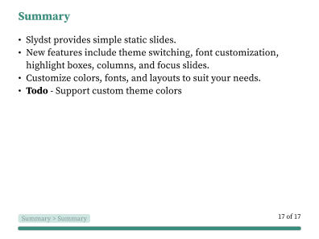</kbd>


---

## Notable Changes from Slydst

- **Hue-based theming:** Easily adjust the color palette by changing `base-hue`.
- **Footer preview:** Breadcrumbs show the current section and slide.
- **Progress slider:** Visual progress bar in the footer.
- **Custom layouts:** Choose from `"small"`, `"medium"`, `"large"` and set custom aspect ratios.
- **Focus slides:** Use `#focus-slide[...]` for emphasis.
- **Two-column slides:** Use `#two-column-slide(left, right, ...)` for side-by-side content.
- **Font customization:** Set `font`, `code-font`, and `font-size` globally.
- **Logo support:** Add a logo to the title slide.
- **Improved block environments:** Enhanced `definition`, `theorem`, `lemma`, `corollary`, and `algorithm` blocks with color and radius options.

## License

See [LICENSE](./LICENSE) for details.
